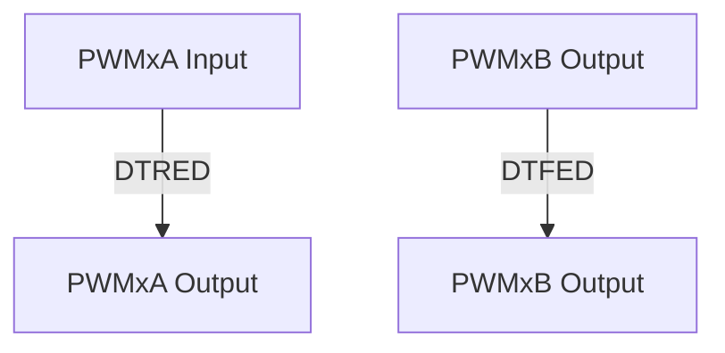

```markdown
| Mode | Mode Description                                                                                     | S0 | S1 | S2 | S3 |
|------|-------------------------------------------------------------------------------------------------------|----:|----:|----:|----:|
| 1    | PWMxA and PWMxB Pass Through/No Delay                                                                  | 1  | 1  | X  | X  |
| 2    | Active High Complementary (AHC), see Figure 41.3-22                                                  | 0  | 0  | 0  | 1  |
| 3    | Active Low Complementary (ALC), see Figure 41.3-23                                                   | 0  | 0  | 1  | 0  |
| 4    | Active High (AH), see Figure 41.3-24                                                                  | 0  | 0  | 0  | 0  |
| 5    | Active Low (AL), see Figure 41.3-25                                                                   | 0  | 0  | 1  | 1  |
| 6    | PWMxA Output = PWMxA In (No Delay)<br>PWMxB Output = PWMxA Input with Falling Edge Delay               | 0  | 1  | 0 or 1 | 0 or 1 |
| 7    | PWMxA Output = PWMxA Input with Rising Edge Delay<br>PWMxB Output = PWMxB Input with No Delay         | 1  | 0  | 0 or 1 | 0 or 1 |

Note:
For all the modes above, the position of the binary switches S4 to S8 is set to 0.
```

Figure 41.3-22. Active High Complementary (AHC) Dead Time Waveforms


Espressif Systems

1551

ESP32-C5 TRM (Version 1.0)

Submit Documentation Feedback
```