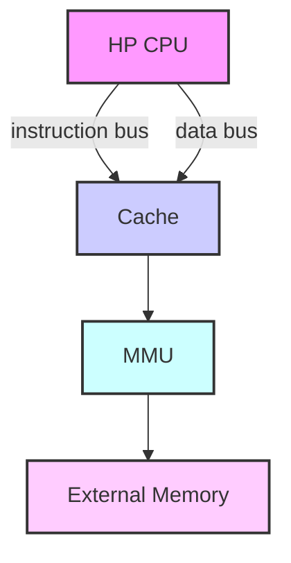

```markdown
- 1: mode is not switched


### 6.3.3 External Memory

ESP32-C5 supports SPI, Dual SPI, Quad SPI, and QPI interfaces that allow connection to external flash and RAM. ESP32-C5 also supports hardware manual encryption and automatic decryption based on XTS-AES algorithm to protect users' programs and data in the external flash and RAM.

#### 6.3.3.1 External Memory Address Mapping

The external memory can be accessed by HP CPU via the cache or accessed by the GDMA. According to information inside the MMU (Memory Management Unit), the cache maps the HP CPU and GDMA's address (0x4200_0000 ~ 0x43FF_FFFF) into a physical address of the external memory. With this address mapping, ESP32-C5 can address up to 32 MB external flash and 32 MB external RAM.

Note that the instruction bus shares the same address space (32 MB) with the data bus to access the external memory.

#### 6.3.3.2 Cache

As shown in Figure 6.3-3, ESP32-C5 has a shared four-way set-associative cache. Its size is 32 KB and its block size is 32 bytes. The instruction bus and data bus can access the cache simultaneously, but the cache can only respond to one of them at a time through arbitration. If a data missing happens, cache controller initiates a request to the external memory.




> flow of control signals

Figure 6.3-3. Cache Structure


#### 6.3.3.3 Cache Operations

ESP32-C5 cache supports the following operations:

1. Write-back
    * Clears dirty bits in the tag memory and updates new data to external memory.
    * After the write-back operation, the new data is updated to external memory.
```